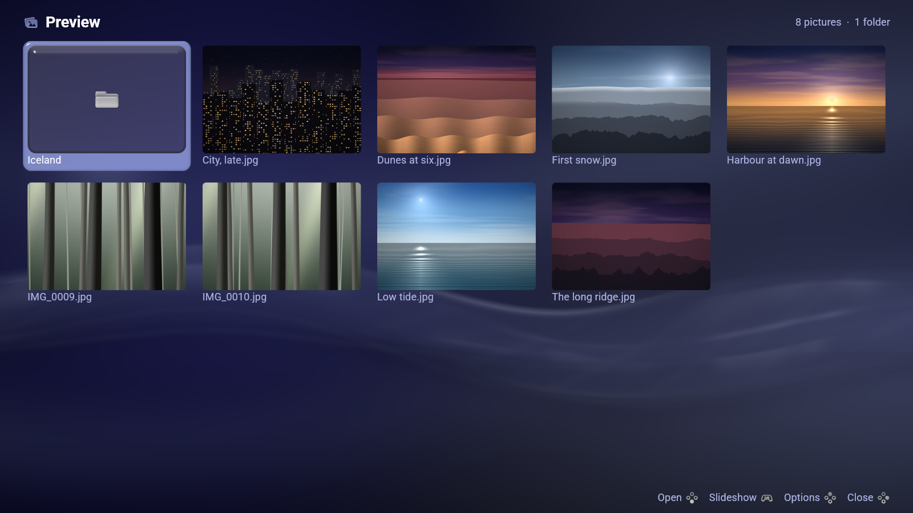
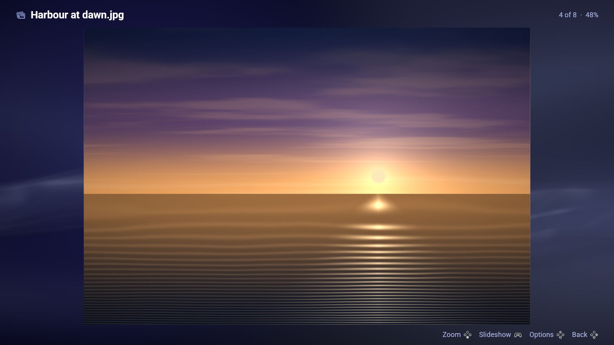
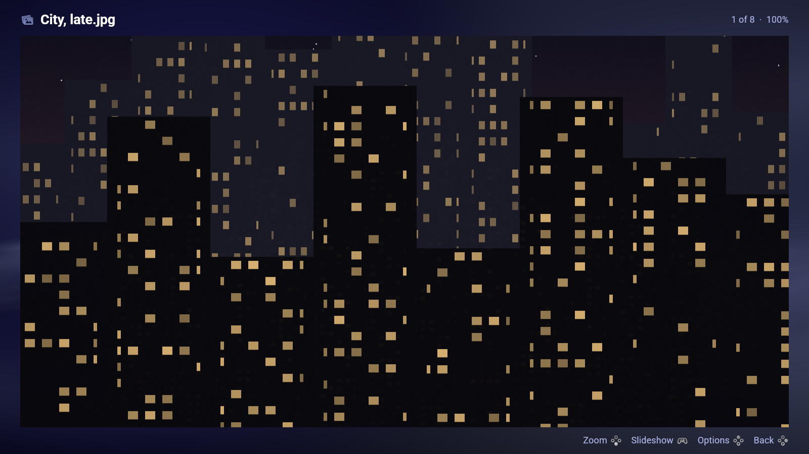

# Imagonsole

**A photo viewer for [LineXinBar](https://github.com/Petexy/LineXinBar), driven
by a controller. It is shown as *Pictures*.**

[](LICENSE)
[](VERSION)
[](Cargo.toml)



`imagonsole` is the project, the package and the command; **Pictures** is what
it is called on the desktop entry, in the menu and on the window. It is built
on [lxb-toolkit](https://github.com/Petexy/lxb-toolkit) — the shell's own
colours, glass, motion, type and marks — and it is an ordinary Wayland
application, so it runs under GNOME or Plasma as readily as under the shell it
was made for.

Its siblings are [Videonsole](https://github.com/Petexy/videonsole) (Videos),
[SongOnSole](https://github.com/Petexy/songonsole) (Music) and
[DistriBumpy](https://github.com/Petexy/distribumpy) (Software Hub).

## Use

```sh
imagonsole                       # the pictures folder
imagonsole ~/Holiday             # that folder
imagonsole ~/Holiday/beach.jpg   # that picture, in its folder
imagonsole --demo                # a made-up folder; nothing of yours is touched
```

A folder is a grid the light travels across. **Only the card being looked at is
drawn as something to press** — the rest are the picture and its name. Names
too long for their card are cut out of the middle, so the end that says *which*
screenshot this is survives along with the extension.



## What it does

- **A photograph opens out of the card it was pressed on**, and goes back into
  it. The crop a card puts on a thumbnail unwinds as it grows, so the first
  frame is the card exactly and the last is the photograph exactly.
- **The photograph itself, at its own resolution** — not a thumbnail of it. The
  pictures either side are read before they are asked for, so stepping through
  a folder shows a photograph rather than a wait for one, and one picture
  crosses to the next half again as fast as a panel moves.
- **Two kinds of zoom, because there are two kinds of control.** A button can
  only say *now*, so `A` walks a ladder of stops — fit, actual size, twice,
  four times — and springs between them. A trigger and a wheel say *how much*,
  so they zoom continuously and are deliberately not sprung. A wheel zooms
  about the pointer, so the picture grows towards the hand.
- **One rule makes the directions unambiguous.** In the viewer a direction
  *pans* wherever the picture is larger than the screen, and *steps to the next
  picture* where it is not. Nothing has to be switched on, and the picture
  itself says which it is going to be. A held direction pans on an accelerating
  ramp, the way the shell moves a floating window.
- **Back closes it at the top of the walk.** Whatever it was opened on is that
  top, and the legend says **Close** rather than Back wherever pressing it
  would close. Opened on a picture, Back closes; opened on a folder, Back walks
  up to that folder and closes there rather than carrying on out to the root of
  the disk.
- **The right way up.** A camera writes the sensor's rows and a note saying
  which way it was held; the note is read, so a portrait is a portrait.
- **The order a person reads in**: `IMG_9` before `IMG_10`, which plain byte
  order gets exactly backwards. Six sort orders, folders first in all of them,
  hidden names on request.
- **Turn, slideshow, and the details** — how many pixels, how large on disk,
  when it was written.
- **Somewhere else to look**: *Open another folder* puts the question to this
  desktop's own file chooser through the portal, and draws the toolkit's own
  where there is no portal to ask.



## Controls

A controller, a keyboard and a pointer are one interface rather than three.
Nothing here is a controller *mode*.

| | A pad | A keyboard, a mouse |
|---|---|---|
| move; in the viewer, **step or pan** | D-pad, left stick | arrows, `wasd`, `hjkl` |
| **zoom, by however much** | **the triggers** | the wheel |
| open, and walk the zoom stops | **A** | Enter, Space |
| back, or **close** | **B** | Escape |
| the Options menu | **Y** | F10, Menu, right-click |
| a slideshow | **Start** | `x` |
| the picture before or after | **LB** / **RB** | Shift-Tab / Tab |

and, on a keyboard alone: `+` `-` zoom a stop, `f` fit, `z` actual size, `r`
and `R` turn, `i` the details, `n` `p` the next and previous picture, `g` back
to the folder, `o` open another folder.

If a pad seems to be ignored:

```sh
imagonsole --controllers
```

A controller whose driver is not in the kernel presents no gamepad at all, and
from the outside that looks exactly like an application that is not reading it.
That flag says which it is. `IMAGONSOLE_DEBUG_ACTIONS=1` prints every action
the application is driven by.

## Install

Rust 1.87 or newer, and the **lxb-toolkit development component** —
`Cargo.toml` names its crate sources at `/usr/share/lxb-toolkit/crates`, and
cargo compiles them into this binary, so nothing of the toolkit is linked at
run time. Beside that: **alsa-lib** with its development files, which the
interface sounds go out through.

```sh
cargo build --release --locked
sudo ./packaging/install.sh --destdir / --prefix /usr
```

`install.sh` places the binary, the desktop entry, the icon and the AppStream
data, and nothing else. For a user-local install instead, with `~/.local/bin`
on `PATH`:

```sh
./packaging/install.sh --destdir / --prefix "$HOME/.local"
```

### As a package

Every recipe calls that same `install.sh`, so a package cannot quietly ship a
different set of files from the line above.

```sh
./packaging/build.sh check     # what a package would have to agree with
./packaging/build.sh arch      # makepkg
./packaging/build.sh debian    # dpkg-deb, on Debian or Ubuntu
./packaging/build.sh fedora    # rpmbuild, on Fedora
./packaging/build.sh nix       # the flake — the one target that does not
                               # need lxb-toolkit installed already
```

Or with Nix and no checkout at all:

```sh
nix run github:Petexy/imagonsole
```

See [`packaging/README.md`](packaging/README.md) for why the toolkit is a
*build* dependency and not a runtime one.

## Verify

```sh
cargo test --release --locked
cargo clippy --all-targets --locked -- -D warnings
cargo fmt --check
```

`--shot` writes one settled frame to a PNG **with no display at all**, through
the same renderer and the same photograph pass the window uses. Every animation
is put where it is going first, so what it photographs is the page at rest.
`--after SECONDS` is the one way to photograph an *animation*: the page is
settled, then pressed, then the picture is taken that long afterwards.

```sh
imagonsole --demo --shot page.png --width 1600 --height 900
imagonsole --demo --shot zoom.png --width 1600 --height 900 --row 1 --view --zoom 1
```

Every picture in this README was taken that way. `--demo` draws a made-up
folder of photographs into this application's own cache and opens that: nothing
of yours is read and nothing of yours is written.

## Languages

Ten, compiled in: German, English (UK), English (US), Spanish, French, Hindi,
Polish, Brazilian Portuguese, Russian and Simplified Chinese — in whichever one
the session speaks, which on LineXinBar is the one Settings ▸ Language names.
See [localization](docs/localization.md).

## How it is put together

| | |
|---|---|
| `src/main.rs` | The window, the input, and `--shot` |
| `src/view.rs` | What is being looked at, and what every control does to it |
| `src/draw.rs` | Putting it on the screen |
| `src/photo.rs` | The photograph, at its own resolution |
| `src/library.rs` | What is in a folder, and in what order |
| `src/legend.rs` | What the buttons do, drawn rather than spelled out |
| `src/pad.rs` | How far the triggers are pulled, and nothing else |
| `src/demo.rs` | The made-up folder behind `--demo` |
| `src/facts.rs` | How large, how many pixels, and when |

**[`docs/design.md`](docs/design.md)** is the long answer: why this application
draws its own window, what a *stage* is and why it is animated state, and how a
change of page is drawn twice over.

## Licence

[GPL-3.0-only](LICENSE), matching LineXinBar and the toolkit. It releases under
the same version as LineXinBar, lxb-toolkit, Videonsole, SongOnSole,
DistriBumpy and CEDM.
