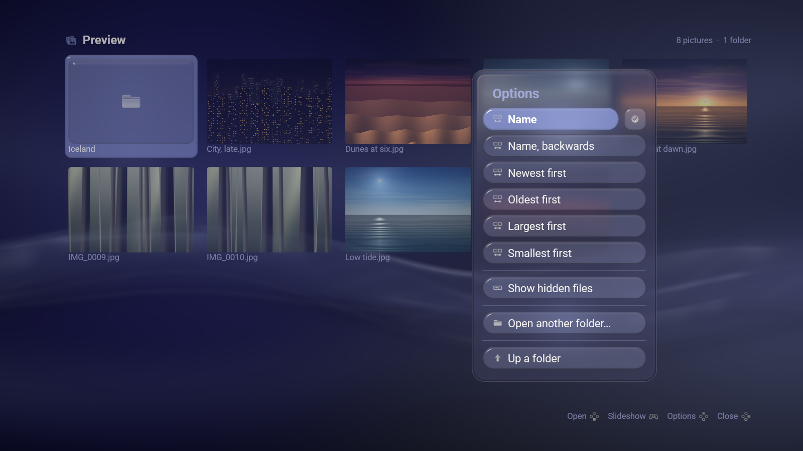
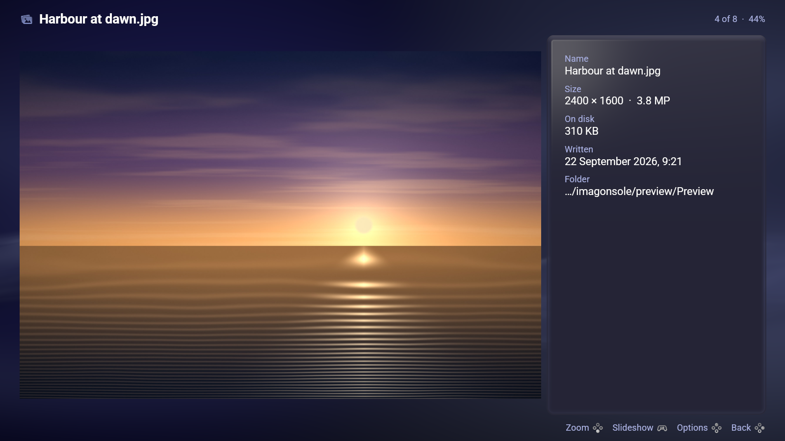

# How Imagonsole is built, and why

This is the long answer. [The README](../README.md) is the short one.

About nine hundred lines of interface and five hundred of picture, over the
toolkit.

## It draws its own window

Most applications built on the toolkit do not need to. `Ui::picture` reads a
file into one 512-pixel cell of a shared atlas — exactly right for the card of
a grid, and about a quarter of what a photograph filling a 1080p screen needs.
A viewer whose whole purpose is the picture cannot show a soft one. So the
frame is composed by `lxb-render` as everywhere else, and the photograph is
drawn over it at its own resolution in a pass of this application's own: its
own texture, its own mip chain, trilinear and anisotropic, in the same colour
space as the page under it.

**Everything else follows from that.** The photograph is drawn *over* the
composed frame, so nothing the toolkit draws can appear on top of one. Rather
than fight it, the picture is given a **stage** — a rectangle it may occupy —
and everything else is laid out outside it. Opening the Options menu narrows
the stage and the picture steps aside; a dialog or the file chooser takes the
screen and the picture fades out. That is why the stage is animated state
rather than a rectangle worked out while drawing.

## A change of page is drawn twice over

Both pages are on the screen while a photograph is opening or leaving, and the
toolkit draws every quad of a layer before every word of it — so a name on a
card is drawn *over* whatever the same frame puts on top of it, however late.
`Ui::recede_behind` is the door on to both halves of the answer: it steps the
wall back and fades it out, and it takes the words out from under the picture.
It is the same call a menu makes over the page it opens on.

One number drives the whole crossing — where the picture is, how round its
corners are, how far the wall has stepped back — so that all of them land on
the same frame.

**The card grows into its own thumbnail while the full-sized picture is read.**
A large photograph takes a moment, and the thumbnail is the picture that was
pressed, so there is something to look at from the first frame rather than an
empty rectangle and the word *Reading…*.

## The triggers, and nothing else

`pad.rs` is the one place this goes past `lxb-input`, and only for the
triggers. An action is a thing that happened and a trigger is a quantity, and
there is no honest way to say "sixty percent" in a list of actions — zoom is
the one control here that genuinely wants the analogue. It maps nothing and has
no opinion about any button: `lxb_toolkit::input` stays the only thing in this
application that decides what a control *means*.

## Where the pictures come from

`--demo` draws a made-up folder of photographs into `$XDG_CACHE_HOME/imagonsole`
and opens it. Nothing of the user's is read or written, and every page above it
is the ordinary code path: the same directory walk, the same decoder, the same
thumbnail. A viewer photographed against a special case would be a picture of
the special case.

The pictures are drawn rather than taken — scenes made out of gradients and
noise, at the resolutions a camera writes — and they are deterministic, so two
shots taken a week apart differ by what changed in the program and by nothing
else. See `src/demo.rs`.

The pictures in the README are taken at the **Indigo** accent, which is not any
particular machine's. The accent is the one setting a picture of the interface
cannot help stating, and shots taken on different days in different colours
would read as different programs. Regenerate them with a scratch settings file
rather than by changing anybody's desktop:

```sh
mkdir -p /tmp/lxb-shot/lxb
printf 'accent = "Indigo"\n' > /tmp/lxb-shot/lxb/shell.toml
export XDG_CONFIG_HOME=/tmp/lxb-shot

imagonsole --demo --shot docs/folder.png  --width 1600 --height 900
imagonsole --demo --shot docs/picture.png --width 1600 --height 900 --row 4 --view
imagonsole --demo --shot docs/zoom.png    --width 1600 --height 900 --row 1 --view --zoom 1
imagonsole --demo --shot docs/options.png --width 1600 --height 900 --menu
imagonsole --demo --shot docs/details.png --width 1600 --height 900 --row 4 --view --details
```

Each flag is applied *after* a frame has been measured — exactly as a real
press is, because a direction only knows whether it pans or steps once the
picture has been measured against the stage.



